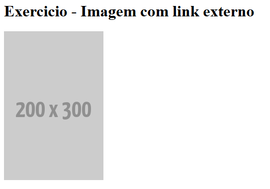
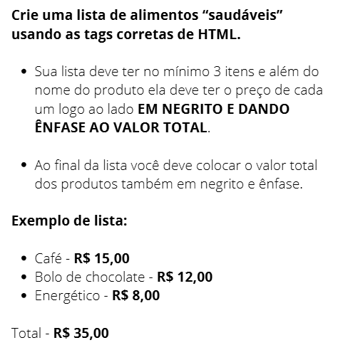
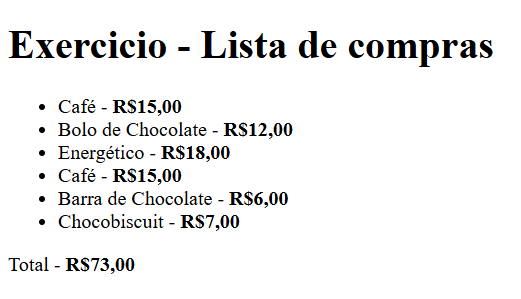
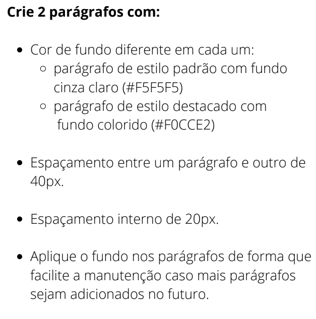
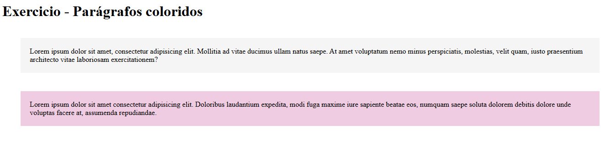

# Exercicios HTML e CSS básico

Exercícios propostos no curso DevEmDobro ao final dos módulos HTML e CSS básico, com o objetivo de testar aprendizado.

Enunciado 1:

Resultado:

Enunciado 2:

Resultado:

Enunciado 3:

Resultado:

## Tecnologias usadas
- HTML
- CSS
